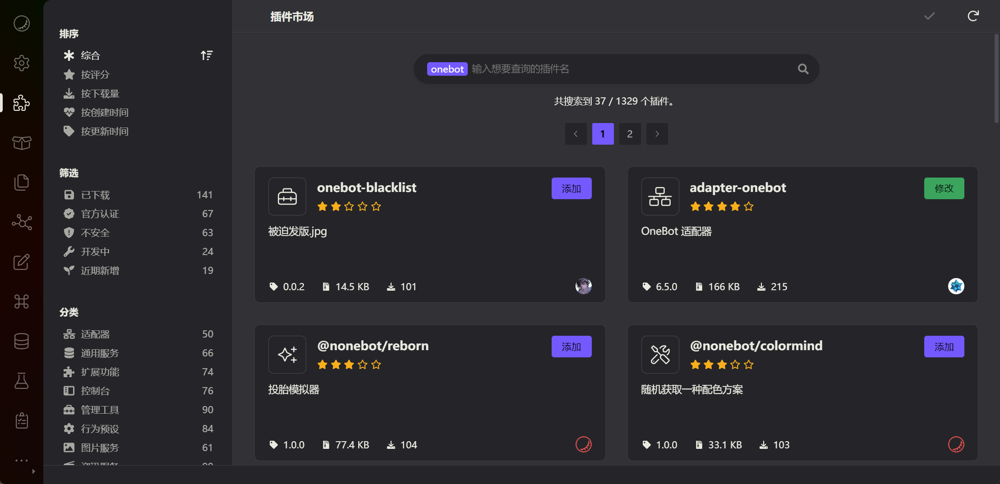
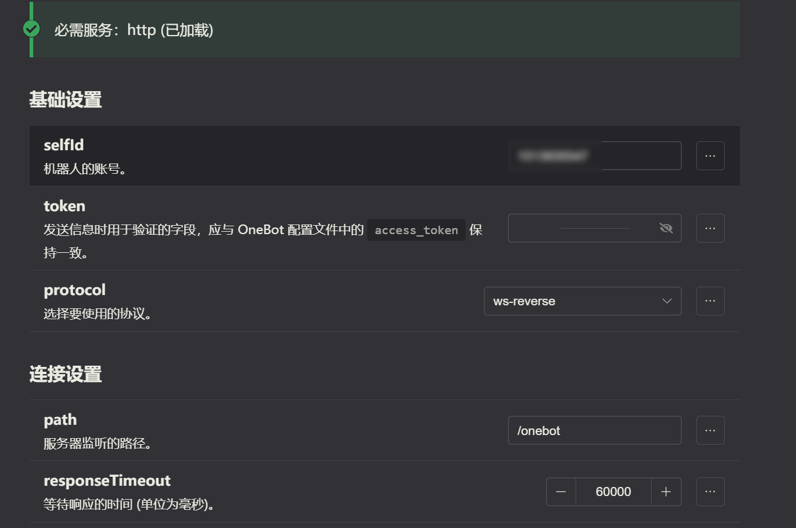
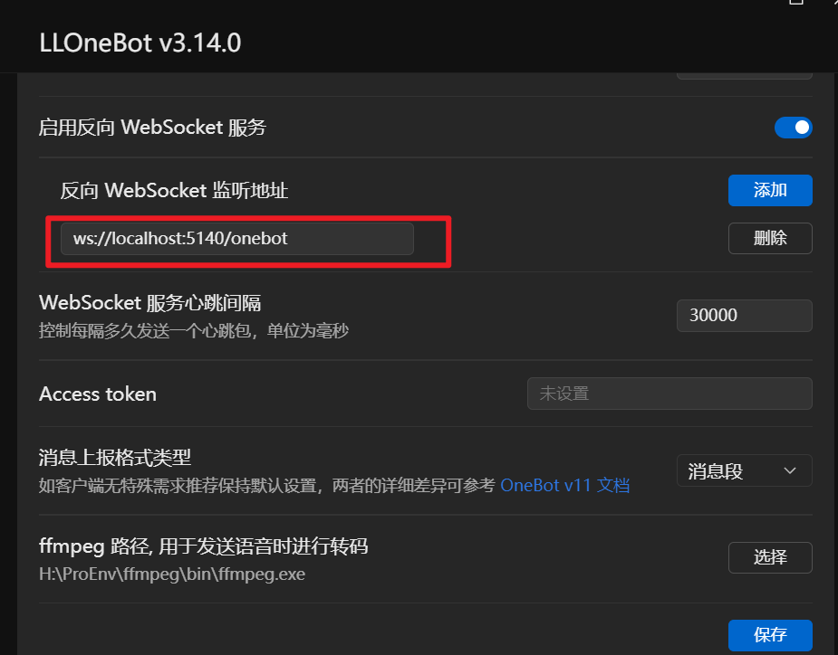
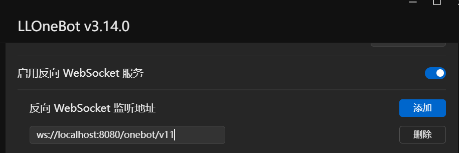

# 配置

## 对接其他框架

::: details 配置 Koishi

### 1. 在 Koishi 插件市场搜索并安装 adapter-onebot

### 2. 配置 adapter-onebot

这里以 WS 反向连接为例

填写 selfId 为你的机器人的 QQ 号

token 可以为空，需与 LLOneBot 配置的 token 一致

protocol 选择 `ws-reverse`

其他配置保持默认即可，保存配置然后启用插件

### 3. 配置完成后，LLOneBot 添加 WS 反向地址

adapter-onebot 的 WS 反向地址为 `ws://127.0.0.1:5140/onebot`

点击保存即可

:::

::: details 配置 NoneBot

### 1. 配置 NoneBot

这里假设你已经安装了 Onebot 适配器

默认情况 NoneBot 是启用了反向 ws 的，可能是默认配置问题，需要配置 token 才能正常连接

修改 NoneBot 配置文件 `.env`，添加 `ONEBOT_ACCESS_TOKEN=你的token`，token 需要和 LLOneBot 配置的 token 一致

然后启用 NoneBot，可以看到 NoneBot 输出的端口号，如 `8080`

### 2. 配置 LLOneBot

在 LLOneBot 配置页面添加反向 WS 地址，地址为 `ws://127.0.0.1:8080/onebot/v11/ws`, 这里的 `8080` 是 NoneBot 输出的端口号，`/onebot/v11/ws` 是 NoneBot onebot 适配器默认的路径

::: tip
记得 LLOneBot 配置的 token 需要和 NoneBot 配置的 一致

:::

## HTTP 配置

::: details HTTP服务端口，用于接收应用端的 HTTP API 调用

如配置的 3000 端口，那么 API 地址为 `http://localhost:3000`

一个简单的发送消息 API 调用示例

:::

::: details HTTP 上报地址

当 LLOneBot 收到消息等事件时，会以 `POST` 请求的方式将事件上报到此地址

::: tip
上报地址必须是 `http://` 开头

HTTP 事件上报，不支持快捷回复等快捷操作
:::

## 正向 WS 配置
::: details 用于接受应用端的正向 WS 连接

如正向 WS 绑定的端口为 3001

需要在应用端配置的WS地址为 `ws://localhost:3001`

::: 

## 反向 WS 配置
::: details 用于 LLOneBot 主动连接应用端绑定的反向WS地址

如在 NoneBot2 配置了 onebot 的端口为 8080，路径为 `/onebot/v11/ws`

那么在 LLOneBot 配置的反向 WS 地址为 `ws://localhost:8080/onebot/v11/ws`

::: 
