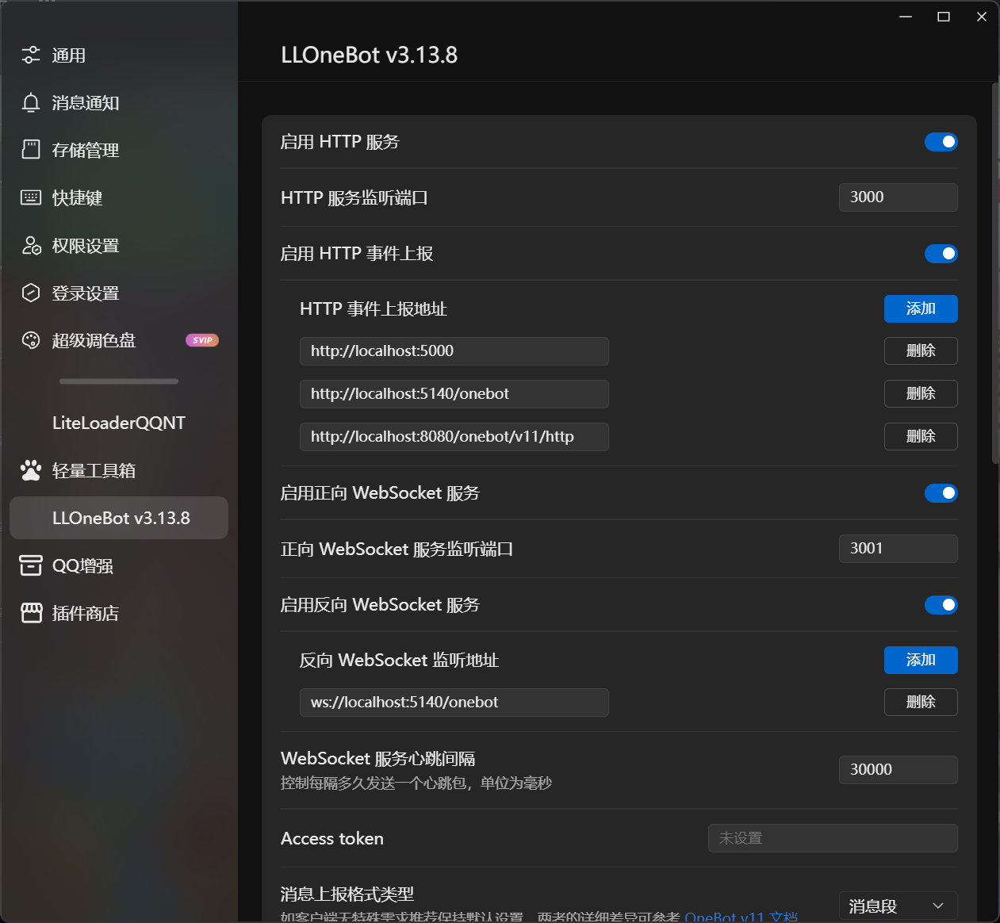
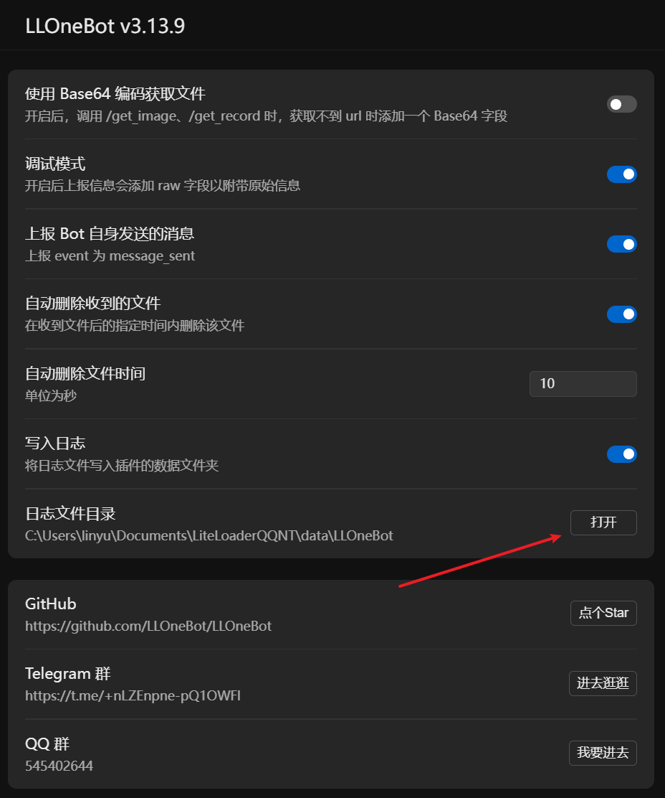

# 配置

## 使用 GUI 配置

在安装 LLOneBot 成功后， QQ 设置侧边栏点击 `LLOneBot` 即可进入配置界面。

HTTP 服务监听地址默认为本地的所有ip

## 使用配置文件

配置文件位于`数据目录`下的`config_QQ号.json`

数据目录可以在 LLOneBot 的设置界面找到并一键打开.

## ffempg配置

ffmpeg下载地址: <https://ffmpeg.org/download.html>