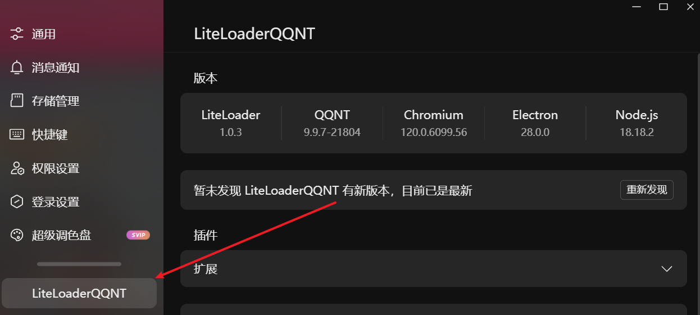
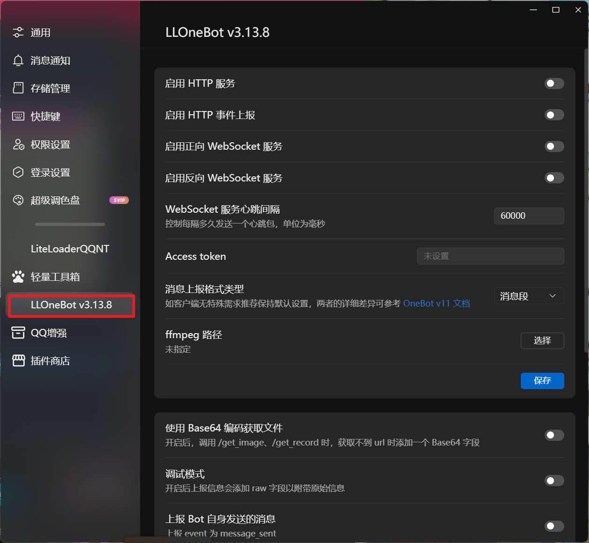

# 快速开始

## QQ 版本

LLOneBot 支持到最新版本的 QQ

不推荐太老的版本，9.9.7(21804) 之前的版本都没有经过仔细测试，可能会有一些问题.

## Windows 用户一键安装方案

<https://github.com/super1207/install_llob/releases>下载exe，双击运行即可，之后打开QQ的设置，看到了 `LLOneBot` 就代表安装成功了.

## 通用安装方法

::: details 安装 LiteLoaderQQNT
**注意在安装之前请先关闭 QQ ！**

推荐使用 [一键安装脚本](https://github.com/Mzdyl/LiteLoaderQQNT_Install/releases)，支持 Windows、Linux、MacOS

安装成功后打开QQ的设置，看到了 `LiteLoaderQQNT` 就代表安装成功了.



::: tip
手动安装见 [LiteLoaderQQNT文档](https://liteloaderqqnt.github.io/guide/install.html)
:::

::: details 安装 LLOneBot

下载 [LLOneBot](https://github.com/LLOneBot/LLOneBot/releases) 最新版本 解压放到 `plugins` 目录下，然后重启 QQ 即可.

::: tip
plugins 目录可以在 LiteLoaderQQNT 的页面找到并一键打开.


目录结构如下:
```
├── plugins
│   ├── LLOneBot
│   │   └── main/main.cjs
│   │   └── preload/preload.cjs
│   │   └── renderer/index.js
│   │   └── manifest.json
│   │   └── node_modules/...
```
:::

::: details 检查是否安装成功

**重启 QQ 后，打开设置，看到 `LLOneBot` ，代表安装成功.**


:::

## Linux 安装

Linux 安装方法与 Windows 类似，只是需要手动安装 LiteLoaderQQNT

如果非要使用 docker 安装 LLOneBot，参考 <https://github.com/LLOneBot/llonebot-docker>

如果你的 Linux 上的 QQ 出现各种问题了，推荐使用兼容性更好的，最新最 in 的无头 NTQQ 框架 [NapCatQQ](https://github.com/NapNeko/NapCatQQ)


