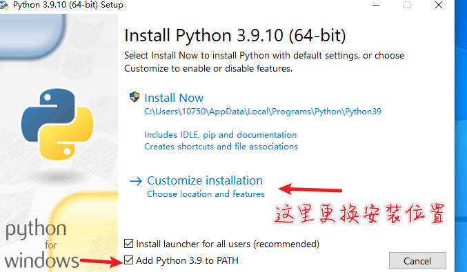
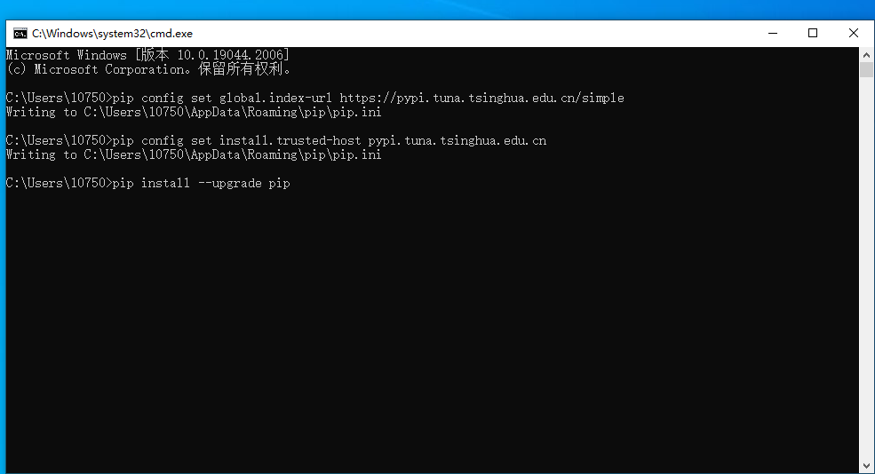
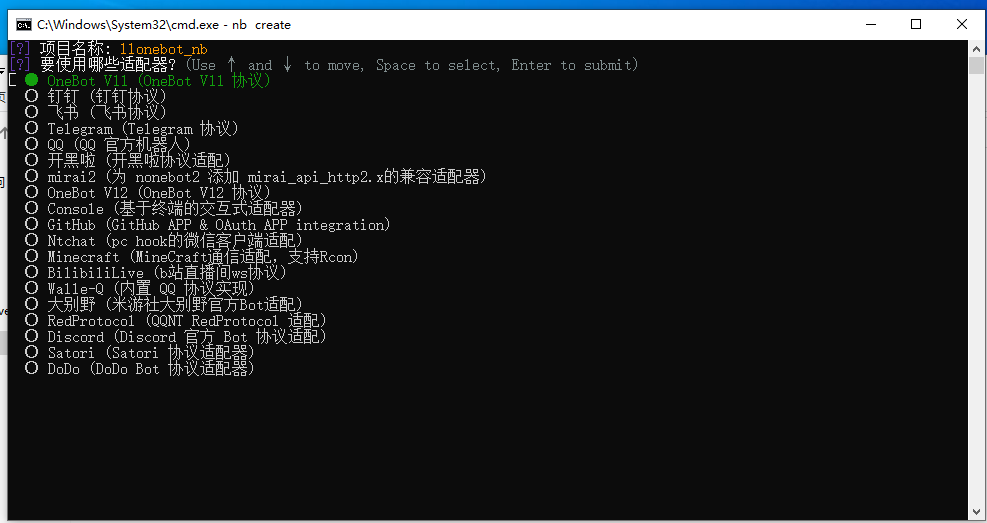
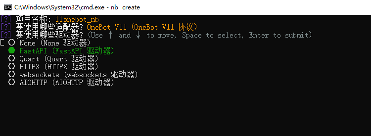
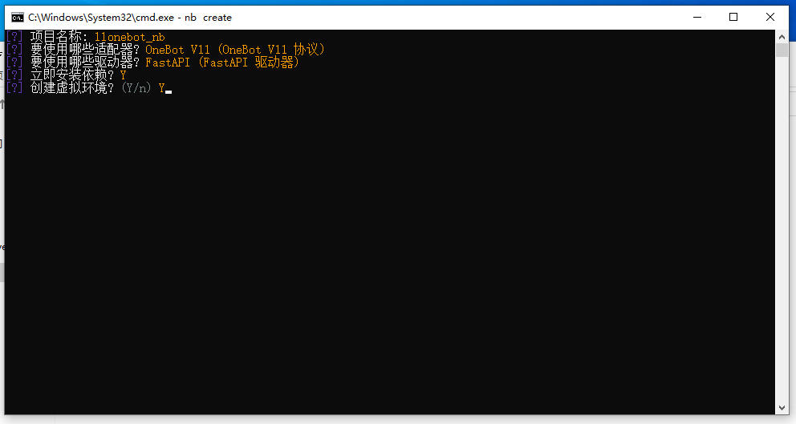
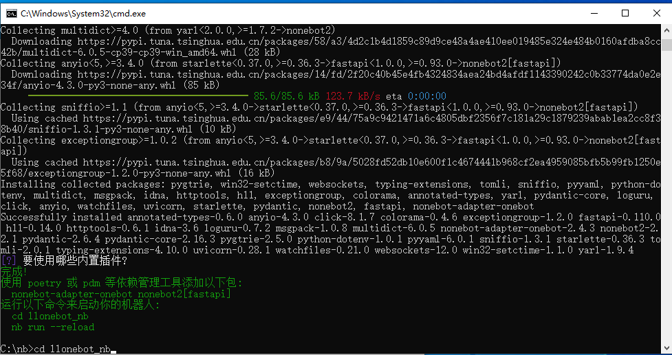
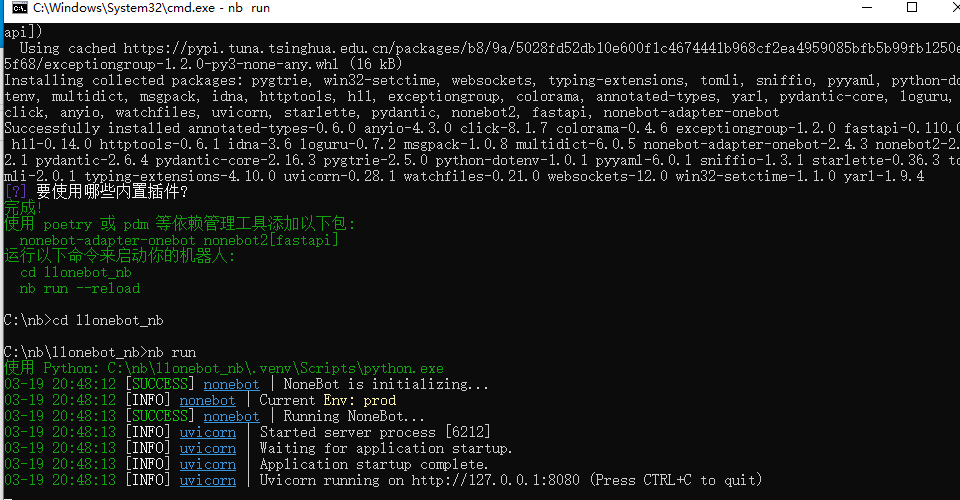

# Windows 下使用 LLOneBot 链接 NoneBot2

## 1. 环境

​**Python 版本 >= 3.9**

[Python 官网](https://www.python.org/)，如果有小白打不开或者找不到下载位置，这里提供一个 [Python 3.9.10](https://syykln.lanzoul.com/iZegc1rwtm1i)。

​测试环境是 Windows 10，Windows 11 应该也一样。低版本 Windows 未测试。

## 2. 安装 Python（已经有 Python 环境的跳过）

​打开安装包需要注意的就是安装位置，以及勾选这里的加入环境变量



​安装完成之后win+R输入cmd打开命令行窗口。分别输入这两行代码配置pip源

```python
pip config set global.index-url https://pypi.tuna.tsinghua.edu.cn/simple
pip config set install.trusted-host pypi.tuna.tsinghua.edu.cn
```

​	在升级一下pip

```
pip install --upgrade pip
```



## 3. 安装 NoneBot

​	

安装 [pipx](https://pypa.github.io/pipx/)

```bash
python -m pip install --user pipx
python -m pipx ensurepath
```


​	如果在此步骤的输出中出现了“open a new terminal”或者“re-login”字样，那么请关闭当前终端并重新打开一个新的终端。

安装脚手架

```bash
pipx install nb-cli
```


​	安装完成后，你可以在命令行使用 `nb` 命令来使用脚手架。如果出现无法找到命令的情况（例如出现“Command not found”字样),重启一下命令行窗口。如果还是不行就请参考 [pipx 文档](https://pypa.github.io/pipx/) 检查你的环境变量

​	在任意一个文件夹位置那里输入cmd回车打开命令行窗口.


​	输入代码

```
nb create
```

​	默认选择一个要使用的模板: bootstrap (初学者或用户)。回车


​	项目名称随意填写,这里使用 llonebot_nb 然后回车。这里空格直接选择第一个，变绿之后直接回车。





​	驱动选择fastapi 




​	立即安装依赖选择Y。创建虚拟环境选择Y。然后等待安装



​	提示要使用哪些内置插件? 直接回车。然后cd 进入刚刚的项目文件夹




​	执行

```
nb run
```



​	出现这样的界面就说明成功了。

​	如果要修改端口或者host地址。在**项目文件夹**中创建一个 `.env` 文本文件，并写入以下内容:

```bash
HOST=0.0.0.0  # 配置 NoneBot 监听的 IP / 主机名
PORT=8080  # 配置 NoneBot 监听的端口
COMMAND_START=["/"]  # 配置命令起始字符
COMMAND_SEP=["."]  # 配置命令分割字符
```

​	更多的配置项在这里[配置 | NoneBot](https://nonebot.dev/docs/appendices/config#内置配置项)

​	至此nb安装完成,你可以去[nb插件商店](https://v2.nonebot.dev/store)按照提示安装你想要的插件

## 4. 安装 LLOneBot

​	[这里已经有详细教程](https://llonebot.github.io/zh-CN/guide/getting-started)

## 5. 连接 NoneBot

​	打开 llonebot 配置文件 data/config_qq.json 启用反向websocket服务。填入。(如果你自己修改了端口就自行修改地址默认是127.0.0.1:8080)。然后保存

​	

```json5
{
    "enableWsReverse": true,
    "wsReverseUrls": [
      "ws://127.0.0.1:8080/onebot/v11/ws/"
    ],
}
```


注：使用[Linux 一键 Docker 安装方案](https://llonebot.com/zh-CN/guide/getting-started#linux-%E4%B8%80%E9%94%AE-docker-%E5%AE%89%E8%A3%85%E6%96%B9%E6%A1%88)时需对脚本运行目录下 docker-compose.yml 配置文件进行以下修改
```
- ONEBOT_WS_URLS=["ws://172.17.0.1:8080/onebot/v11/ws"]
```

​	显示一个bot QQ 链接说明成功！

**到此完成！鼓掌祝贺**
